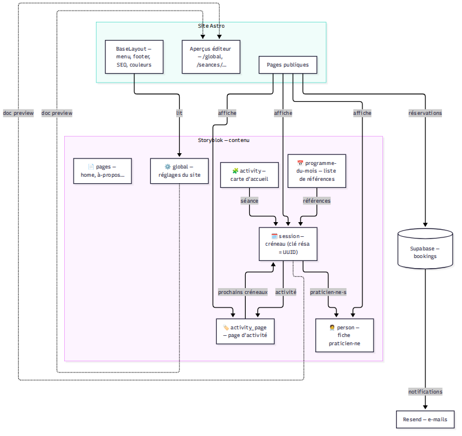
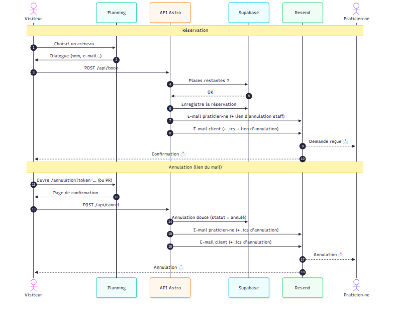

# Architecture — La Parent'elle

Deux schémas (français) pour comprendre le site globalement. Sources Mermaid
(modifiables) + PNG (vérifiés).

## 1. Modèle de contenu

Qui référence quoi dans Storyblok, et ce que le site en fait.

```mermaid
%% aperçu — voir modele-contenu.mmd pour la source
```


Points clés :
- `programme-du-mois` ne contient que des **références** vers des stories
  `session` (`seances/`) — **l'UUID de la story est la clé de réservation**.
- `session` pointe vers sa `activity_page` et ses `person` (`people`).
- Les cartes `activity` (accueil) et les pages `activity_page` dérivent leurs
  créneaux des sessions liées — jamais l'inverse.
- `global` et les aperçus `seances/…` sont **preview uniquement** (404 en prod).

## 2. Réservation & annulation

```mermaid
%% aperçu — voir flux-reservation.mmd pour la source
```


Points clés :
- `/api/book` : contrôle des places → enregistrement Supabase → 2 e-mails
  Resend (praticien·ne + client, avec `.ics` et liens d'annulation séparés).
- `/annulation?token=…` + `/api/cancel` : annulation douce (statut `annulé`,
  jamais de suppression), cutoff 24 h côté client, `.ics` d'annulation envoyé
  aux deux parties.
